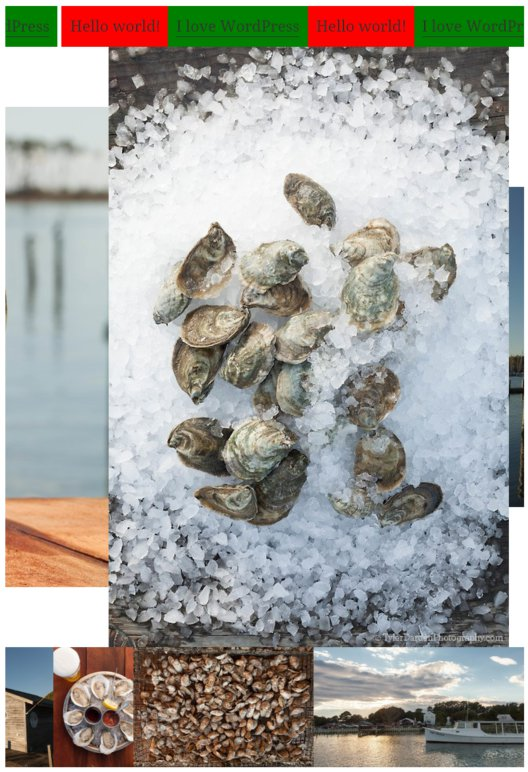

# G11 Carousel

A very simple, non-interactive carousel that can be used either as a WordPress plugin or standalone.

## WordPress

1. Build the plugin ZIP per the parent [README.md](README.md)

2. Install the plugin ZIP in WordPress and activate it.

3. Create a carousel using the shortcode *g11-carousel* with optional height and duration parameters.

    [g11-carousel duration="5"]
    
Hello world!

    
<a href="http://wordpress.com">I love WordPress</a>

    [/g11-carousel]
    
    [g11-carousel]
    
    
    
    
    
    
    [/g11-carousel]
    
    [g11-carousel height="150px"]
    
    
    
    
    
    
    [/g11-carousel]

## Standalone

To use standalone, include the G11 carousel stylesheet and script on your page, and then
declare elements.  Each carousel must be a DIV with class 'g11-carousel', containing a
DIV with class 'g11-carousel-stage'.  Attributes 'data-height' and 'data-duration' can be
set on the stage DIV.

    <link rel='stylesheet' id='g11-carousel-css'  href='/uri-to/g11-carousel/css/g11-carousel.css' type='text/css'  />
    
    
    
    

      

        
Hello world!

        
<a href="http://wordpress.com">I love WordPress</a>

      

    

    
     

       

          
          
          
          
          
          
      

    

    
    

      

         
         
         
         
         
         
      

    

## Screenshot

The example above, shown in a WordPress post:

## Bugs/Limitations

* Some rendering issues with white bars between items, which I think is due to jQuery.  This can also cause
  a bit of a jump at loop finish.
* You cannot mix IMGs and DIVs at the top level.  In order to do this, you have to place each image in a DIV tag.